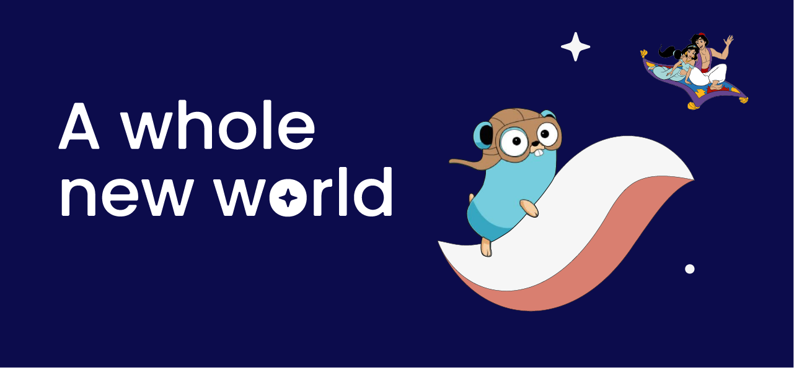

<div align="center">
  
</div>

<p align="center">
    <a href="https://pkg.go.dev/github.com/NethermindEth/starknet.go">
        
    </a>
    <a href="https://github.com/nethermindeth/starknet.go/blob/main/LICENSE">
        
    </a>
    <a href="https://github.com/nethermindeth/starknet.go/actions/workflows/test.yml">
        
    </a>
    <a href="https://twitter.com/NethermindStark">
      
    </a>
    <a href="https://github.com/nethermindeth/starknet.go">
      
    </a>
</p>

<h1 align="center">Get the gopher high on StarkNet</h1>

<a href="https://pkg.go.dev/github.com/NethermindEth/starknet.go">

</a>

#### :warning: `starknet.go` is currently under active development and is experiencing a rearchitecture. It will undergo breaking changes.

`starknet.go` will get your golang backends and WASM frontends to Starknet easily.
With simple abstractions for the Starknet RPC, account management and common
operations on the wallets. The package has excellent documentation for a smooth
0 to 1 experience.

# 🌟 Features

- Seamless interaction with the Starknet RPC
- Tight integration with Juno (uses the RPC types, resulting in updates and
  breaking changes landing quickly)
- Account management: Deploy accounts easily
- Good concurrency support

# Getting Started

- library documentation available at [pkg.go.dev](https://pkg.go.dev/github.com/NethermindEth/starknet.go).
- [curve example](./examples/curve) initializing the StarkCurve for signing and verification
- [contract example](./examples/contract) for smart contract deployment and function call
- [account example](./examples/contract) for Account initialization and invocation call

### Run Examples

***starknet simpleCall***

```sh
cd examples/simpleCall
go mod tidy
go run main.go
```


### RPC

`starknet.go` RPC implements the [StarkNet RPC Spec](https://github.com/starkware-libs/starknet-specs):

| Method                                         | Implemented (*)    |
| ---------------------------------------------- | ------------------ |
| `starknet_getBlockByHash`                      | :heavy_check_mark: |
| `starknet_getBlockByNumber`                    | :heavy_check_mark: |
| `starknet_getTransactionByHash`                | :heavy_check_mark: |
| `starknet_getTransactionReceipt`               | :heavy_check_mark: |
| `starknet_getClass`                            | :heavy_check_mark: |
| `starknet_getClassHashAt`                      | :heavy_check_mark: |
| `starknet_getClassAt`                          | :heavy_check_mark: |
| `starknet_call`                                | :heavy_check_mark: |
| `starknet_blockNumber`                         | :heavy_check_mark: |
| `starknet_chainId`                             | :heavy_check_mark: |
| `starknet_syncing`                             | :heavy_check_mark: |
| `starknet_getEvents`                           | :heavy_check_mark: |
| `starknet_addInvokeTransaction`                | :heavy_check_mark: |
| `starknet_addDeployTransaction`                | :heavy_check_mark: |
| `starknet_addDeclareTransaction`               | :heavy_check_mark: |
| `starknet_estimateFee`                         | :heavy_check_mark: |
| `starknet_getBlockTransactionCountByHash`      | :heavy_check_mark: |
| `starknet_getBlockTransactionCountByNumber`    | :heavy_check_mark: |
| `starknet_getTransactionByBlockNumberAndIndex` | :heavy_check_mark: |
| `starknet_getTransactionByBlockHashAndIndex`   | :heavy_check_mark: |
| `starknet_getStorageAt`                        | :heavy_check_mark: |
| `starknet_getNonce`                            | :heavy_check_mark: |
| `starknet_getStateUpdate`                      | :heavy_check_mark: |
| *`starknet_traceBlockTransactions`             | :x:                |
| *`starknet_traceTransaction`                   | :x:                |

> (*) some methods are not implemented because they are not yet available
> from [eqlabs/pathfinder](https://github.com/eqlabs/pathfinder).

### Run Tests

```go
go test -v ./...
```

### Run RPC Tests

```go
go test -v ./rpc -env [mainnet|devnet|testnet|mock]
```

### Run Benchmarks

```go
go test -bench=.
```

### Compatibility and stability


## 🤝 Contribute

We're always looking for passionate developers to join our community and
contribute to `starknet.go`. Check out our [contributing guide](./docs/CONTRIBUTING.md)
for more information on how to get started.

## 📖 License

This project is licensed under the **MIT license**.

See [LICENSE](LICENSE) for more information.

Happy coding! 🎉
## Contributors ✨

Thanks goes to these wonderful people
([emoji key](https://allcontributors.org/docs/en/emoji-key)):

<!-- ALL-CONTRIBUTORS-LIST:START - Do not remove or modify this section -->
<!-- prettier-ignore-start -->
<!-- markdownlint-disable -->
<table>
  <tbody>
    <tr>
      <td align="center" valign="top" width="14.28%"><a href="https://github.com/drspacemn"><br /><sub><b>drspacemn</b></sub></a><br /><a href="https://github.com/NethermindEth/starknet.go/commits?author=drspacemn" title="Code">💻</a></td>
      <td align="center" valign="top" width="14.28%"><a href="https://github.com/gregoryguillou"><br /><sub><b>Gregory Guillou</b></sub></a><br /><a href="https://github.com/NethermindEth/starknet.go/commits?author=gregoryguillou" title="Code">💻</a></td>
      <td align="center" valign="top" width="14.28%"><a href="https://github.com/tarrencev"><br /><sub><b>Tarrence van As</b></sub></a><br /><a href="https://github.com/NethermindEth/starknet.go/commits?author=tarrencev" title="Code">💻</a></td>
      <td align="center" valign="top" width="14.28%"><a href="https://github.com/alex-sumner"><br /><sub><b>Alex Sumner</b></sub></a><br /><a href="https://github.com/NethermindEth/starknet.go/commits?author=alex-sumner" title="Code">💻</a></td>
      <td align="center" valign="top" width="14.28%"><a href="https://github.com/broody"><br /><sub><b>Yun</b></sub></a><br /><a href="https://github.com/NethermindEth/starknet.go/commits?author=broody" title="Code">💻</a></td>
      <td align="center" valign="top" width="14.28%"><a href="https://github.com/rzmahmood"><br /><sub><b>Zoraiz Mahmood</b></sub></a><br /><a href="https://github.com/NethermindEth/starknet.go/commits?author=rzmahmood" title="Code">💻</a></td>
      <td align="center" valign="top" width="14.28%"><a href="https://github.com/LucasLvy"><br /><sub><b>Lucas @ StarkWare</b></sub></a><br /><a href="https://github.com/NethermindEth/starknet.go/commits?author=LucasLvy" title="Code">💻</a></td>
    </tr>
    <tr>
      <td align="center" valign="top" width="14.28%"><a href="https://github.com/coburn24"><br /><sub><b>Coburn</b></sub></a><br /><a href="https://github.com/NethermindEth/starknet.go/commits?author=coburn24" title="Code">💻</a></td>
      <td align="center" valign="top" width="14.28%"><a href="https://github.com/Larkooo"><br /><sub><b>Larko</b></sub></a><br /><a href="https://github.com/NethermindEth/starknet.go/commits?author=Larkooo" title="Code">💻</a></td>
      <td align="center" valign="top" width="14.28%"><a href="https://github.com/oxlime"><br /><sub><b>oxlime</b></sub></a><br /><a href="https://github.com/NethermindEth/starknet.go/commits?author=oxlime" title="Code">💻</a></td>
      <td align="center" valign="top" width="14.28%"><a href="http://mxxn.io"><br /><sub><b>Blaž Hrastnik</b></sub></a><br /><a href="https://github.com/NethermindEth/starknet.go/commits?author=archseer" title="Code">💻</a></td>
      <td align="center" valign="top" width="14.28%"><a href="https://github.com/FlorianRichardSMT"><br /><sub><b>Florian</b></sub></a><br /><a href="https://github.com/NethermindEth/starknet.go/commits?author=FlorianRichardSMT" title="Code">💻</a></td>
      <td align="center" valign="top" width="14.28%"><a href="https://github.com/greged93"><br /><sub><b>greged93</b></sub></a><br /><a href="https://github.com/NethermindEth/starknet.go/commits?author=greged93" title="Code">💻</a></td>
      <td align="center" valign="top" width="14.28%"><a href="https://github.com/jney"><br /><sub><b>Jean-Sébastien Ney</b></sub></a><br /><a href="https://github.com/NethermindEth/starknet.go/commits?author=jney" title="Code">💻</a></td>
    </tr>
    <tr>
      <td align="center" valign="top" width="14.28%"><a href="https://runningbeta.io"><br /><sub><b>Kristijan Rebernisak</b></sub></a><br /><a href="https://github.com/NethermindEth/starknet.go/commits?author=krebernisak" title="Code">💻</a></td>
    </tr>
  </tbody>
</table>

<!-- markdownlint-restore -->
<!-- prettier-ignore-end -->

<!-- ALL-CONTRIBUTORS-LIST:END -->

This project follows the
[all-contributors](https://github.com/all-contributors/all-contributors)
specification. Contributions of any kind welcome!
